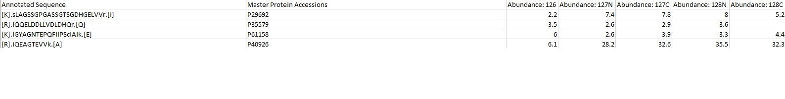

# Documentation PBLMM

PBLMM is a cross-platform application for statistical analysis of proteomics datasets. It applies linear mixed effects models to assess differential protein expression, taking peptide level information into account.

## Usage

### Install

Run the provided installer for MacOS or Windows. See Releases

The Windows Installer will install the application under /USER/AppData/Local/PBLMM. There you can find the Result files.

### Input data

PBLMM is directly compatible with peptide or PSM files from ProteomeDiscoverer with its default naming of the columns. PBLMM is primarily label based, meaning the algorithm identifies the relevant columns from the column header names. If different names are used, the user can simply provide the custom names in the input form of the GUI making it compatible with any possible input data file, as long as they contain the relevant data columns.

The input file needs to be a tab-delimited text file in the wide format:

Note: The column names can differ but need to be specified. The input file can also contain other columns that are ignored by the algorithm.

The quantification columns should share a string that defines a quantification column, as seen as "Abundance" in the above example.

Additionally you need a tab delimited file containing the treatment specifications according to the order in your input file and potential technical replicates and multiplexes or MS runs. The first column of that design file should be named "conditions" and contain the treatment conditions in the same order as the abundance columns in your PSM/Peptide file. Conditions with the same name will be treated as replicates and grouped together for analysis. If applicable the second column contains the technical replicates and is named "techreps", while the third columns contains MS run identificator and is called "multiplex". If the last two columns are not present, all samples are assumed to be independent biological replicates.

### Calculations

PBLMM will automatically calculate the differential expression of all possible combinations of treatments.

In the implemented statistical model, the expression of each protein is separately modelled by a linear mixed effects model:
y(i)= ß0+βXi+ui+εi
Where yi denotes expression of peptide i, β_0 is the individual protein’s global intercept, βXi is the linear combination of indicator variables encoding categorical experimental conditions, ui is the additive random intercept of peptide i with ui ~ N(0,σ2u), and εi are residual errors with εi ~ N(0,σ2ε). Note that this collapses to ordinary linear regression when there are no multiple peptide measurements per protein. Additionally, the variance of the response variable is defined by additional variance components: The peptide sequence, the technical replicates, the multiplex it was run in (in case of TMT data) and residual unexplained variance.  

### Results

The Results file will contain summed protein quantifications for each accession (to provide replicate quantifications for plotting). This quantification is NOT used for statistical analysis and is just used for visualization purposes. 

Additionally the Result file will contain columns for calculated P values, fold changes and q values (Benjamini Hochberg FDR). The naming of the columns is as follows:

p_value_Control_TreatmentX, fold_change_Control_TreatmentX etc.

The naming corresponds to the log2 ratio of the latter treatment versus the first treatment. For the above example, that would mean log2(TreatmentX/Control). A positive value interprets as more protein in TreatmentX compared to the Control.

The Result file is located in the installation folder of the application.

For Windows: C://User/NAME/AppData/Local/PBLMM/appVERSION/Resources/app/data/
Note: AppData is a hidden folder. Change view settings to see the folder.
